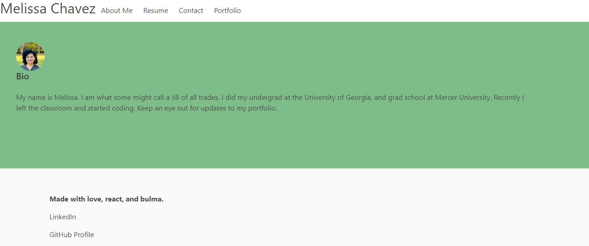

# React Personal Porfolio

## Table of contents

- [General info](#general-info)
- [Technologies](#technologies)
- [App](#app)
- [Contact me](#contact-me)

## General info

In this project I built a personal portfolio using React and Bulma.

## Technologies

Project is created with:

- React
- Bulma

## App

- [Deployed Link](https://react-personal-portfolio23.herokuapp.com/)

- App Screenshot

  

## Contributions

-https://react-bulma.dev/en/storybook

-https://bulma.io/documentation/

## Contact me

- [Email: mel.chavez.code@gmail.com](mailto:mel.chavez.code@gmail.com)
- [GitHub: 12MChavez](https://github.com/12MChavez)
